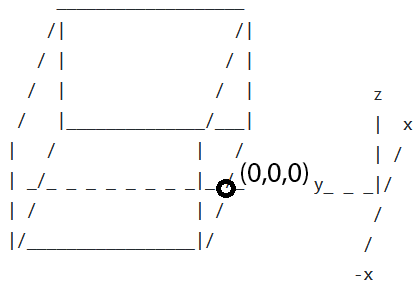
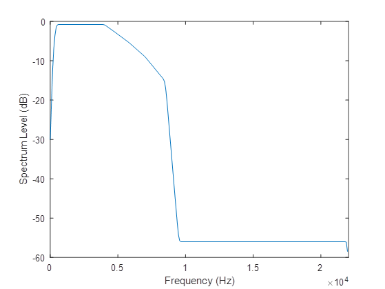

import Tabs from "@theme/Tabs";
import TabItem from "@theme/TabItem";

## Simulating the audio signals received by the hearing aid

A listener – or receiver – is sitting or standing in a small room that has low to moderate reverberation. The person is listening to a target talker, who is selected from our set of 40 speakers. The target talker is producing one of our unique 7-10 word Clarity utterances. Simultaneously, an interferer sound is playing; this is either a competing talker or a continuous noise source (e.g., a washing machine). The target and interferer are at the same height as the listener. The room dimensions, boundary materials, and the locations of the listener, target and interferer are randomised (discussed below). An example scenario is shown in Figure 1. The room geometry showing origin location is defined in Figure 2.

<Tabs>
<TabItem value="scene" label="Example Scene" defaul>
<figure id="fig1">

<figcaption>Figure 1. Example overview.</figcaption>
</figure>
</TabItem>
<TabItem value="geometry" label="Room Geometry">
<figure id="fig2">

<figcaption>Figure 2. Geometry definition.</figcaption>

</figure>
</TabItem>
</Tabs>

Figure 3, below, shows the basic scene generator. The sound at the receiver is generated first by convolving the source signals with Binaural Room Impulse Responses (BRIRs). The reverberated speech and noise signals are then summed after appropriate gains are applied. The gains are set to achieve a Signal-to-Noise Ratio (SNR), which is chosen pseudo-randomly between limits. The BRIRs are generated using the RAVEN Geometric Room Acoustic Model \[[1](#refs)\].

There are additional signal paths and outputs generated that have been omitted from Figure 3 for clarity. In addition to the reverberated signals associated with the hearing aid microphones, the signal close to the eardrum is also generated. You can also access the reverberated speech and noise signals before they are mixed.

*Figure 3. Simplified diagram of the scene generator. RIR refers to Room Impulse Response, HRTFs refers to Head Related Transfer Functions, SNRs are signal-to-noise ratios, and gain calc. indicates gain calculation. Dry here means anechoic. The outputs are noisy speech signals.*

## Room Geometry

- Cuboid rooms with dimensions length, $L$, by width, $W$, by height, $H$.
- Length $L$ set using a uniform probability distribution random number generator with $3 \le L (m) \le 8$.
- Height $H$ set using a Gaussian distribution random number generator with a mean of $2.7 m$ and standard deviation of $0.8 m$.
- Area $L \times W$ set using a Gaussian distribution random number generator with mean $17.7 m^2$ and standard deviation of $5.5 m^2$.

## Room Materials

One of the walls of the room is randomly selected for the location of the door. The door can be at any position with the constraint of being at least at 20 cm from the corner of the wall.

A window is placed on one of the other three walls. The window could be at any position of the wall but at 1.9 m height and at 0.4 m from any corner. The curtains are simulated to the side of the window. For larger rooms, a second window and curtains are simulated following a similar methodology.

A sofa is simulated at a random position as a layer on the wall and the floor. Finally, a rug is simulated at a random location on the floor.

## The receiver

The receiver has position, $\vec{r} = (x_r,y_r,z_r)$

This is positioned within the room using uniform probability distribution random number generators for the x and y coordinates (see Figure 2 for origin location). There are constraints to ensure that the receiver is not too close to the wall:

- $-W/2+1 \le x_r \le W/2-1$
- $1 \le y_r \le L-1$
- $z_r$ either $1.2 m$ (sitting) or $1.6 m$ (standing).

The receiver is positioned so as to be roughly facing the target talker. That is to say, within $\pm 30$ degrees of target. The angle = $7.5n$ where $n$ is an integer and $|n| \le 4$.

## The target talker

The target talker has position $\vec{t} = (x_t,y_t,z_t)$

The target talker is positioned within the room using uniform probability distribution random number generators for the coordinates. Constraints ensure the target is not too close to the wall or receiver. It is set to have the same height as the receiver.

- $-W/2+1 \le x_t \le W/2-1$
- $1 \le y_t \le L-1$
- $|r-t| > 1$
- $z_t=z_r$

A speech directivity pattern is used, which is directed at the listener.

## The interferer

The interferer has position $\vec{i} = (x_i,y_i,z_i)$

The interferer is a single point source radiating speech or non-speech noise omnidirectionally. It is placed within the room using uniform probability distribution random number generators for the coordinates. These constraints ensure the interferer is not too close to the wall or receiver. It is set to be at the same height as the receiver. Note, this means that the interferer can be at any angle relative to the receiver.

- $-W/2+1 \le x_i \le W/2-1$
- $1 \le y_i \le L-1$
- $|r-i| \gt 1$
- $z_i = z_r$

## Timing

- The target sound starts 2 seconds after the start of the interferer. This is so the target is clear and unambiguously identifiable for listening tests. This also gives the hearing aid algorithms some time to adjust to the background noise.
- The interferer continues 1 second after the target has finished, so that all words in the target utterance can be masked.

## Signal-to-Noise Ratio (SNR)

The mixtures are engineered such that the target utterances are at an appropriate level of intelligibility when processed by the default hearing aid software. This is achieved by scaling the interferer. Pilot tests have been conducted to get this approximately correct. Scaling is done this way because it does not require recomputing the BRIRs. Note that the interferer can be at any azimuth from the point of view of the listener/receiver.

A desired signal-to-noise ratio, SNRD (dB), is chosen using a uniform probability distribution random number generator between the limits of ranges specified for the speech and non-speech interferers. The better ear SNR, here termed BE_SNR, which models the better ear effect in binaural listening, is calculated for the reference channel (channel 1, which corresponds to the front microphone of the hearing aid). This value is used to scale all interferer channels. The procedure is described below.

For the reference channel,

- The segment of the interferer that overlaps with the target (without padding) , i‘, and the target (without padding), t‘, are extracted
- Speech-weighted SNRs are calculated for each ear, SNRL and SNRR:
  - Signals i‘ and t’ are separately convolved with a speech-weighting filter, h (specified below).
  - The rms is calculated for each convolved signal.
  - SNRL and SNRR are calculated as the ratio of these rms values.
- The BE_SNR is selected as the maximum of the two SNRs: BE_SNR = max(SNRL and SNRR).

Then per channel,

- The whole interferer signal, i, is scaled by the BE_SNR
  - $i = i*BE_{SNR}$
- Finally, i is scaled as follows:
  - $i = i*10^{((-SNR_D)/20)}$
  
The speech-weighting filter is an FIR designed using the host window method \[[2](#refs), [3](#refs)\]. The specification is:

- Frequency (Hz) = `[0,     150,    250,    350,    450,    4000,   4800,   5800,   7000,   8500,   9500,    22050]`;
- Magnitude of transfer function at each frequency = `[0.0001, 0.0103, 0.0261, 0.0419, 0.0577, 0.0577, 0.046,  0.0343, 0.0226, 0.0110, 0.0001, 0.0001]`;

*Figure 4, Speech weighting filter transfer function graph.*

## References

1. Schröder, D. and Vorländer, M., 2011, January. RAVEN: A real-time framework for the auralization of interactive virtual environments. In Proceedings of Forum Acusticum 2011 (pp. 1541-1546). Denmark: Aalborg.
2. Abed, A.H.M. and Cain, G.D., 1978. Low-pass digital filtering with the host windowing design technique. Radio and Electronic Engineer, 48(6), pp.293-300.
3. Abed, A.E. and Cain, G., 1984. The host windowing technique for FIR digital filter design. IEEE transactions on acoustics, speech, and signal processing, 32(4), pp.683-694.
